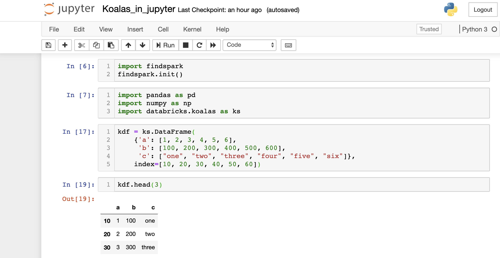
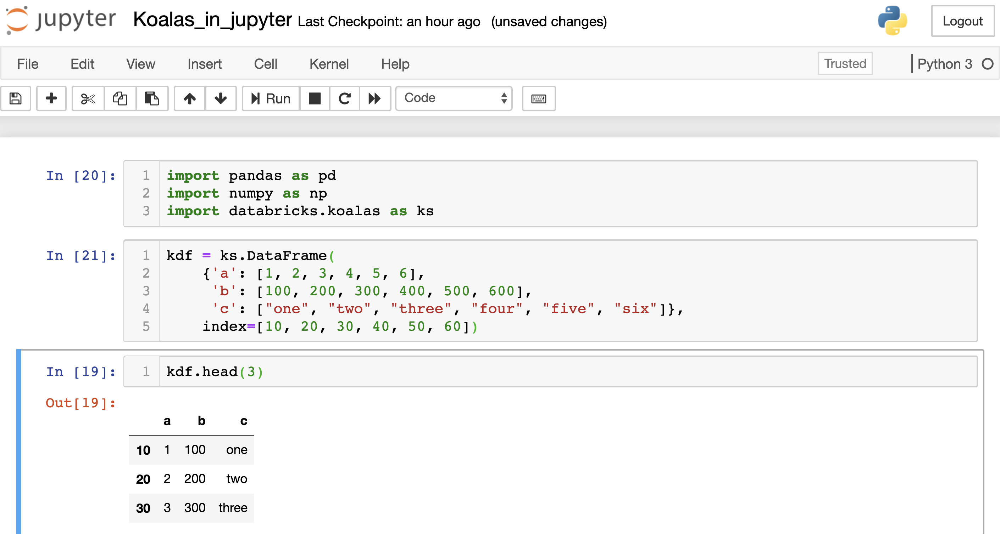

===
FAQ
===

What's the project's status?
----------------------------

This project is currently in beta and is rapidly evolving.
We plan to do weekly releases at this stage.
You should expect the following differences:

 - some functions may be missing. Please create a GitHub issue if your favorite function is not yet supported. We also document all the functions that are not yet supported in the `missing directory <https://github.com/databricks/koalas/tree/master/databricks/koalas/missing>`_.

 - some behavior may be different, in particular in the treatment of nulls: Pandas uses
   Not a Number (NaN) special constants to indicate missing values, while Spark has a
   special flag on each value to indicate missing values. We would love to hear from you
   if you come across any discrepancies

 - because Spark is lazy in nature, some operations like creating new columns only get 
   performed when Spark needs to print or write the dataframe.

Is it Koalas or koalas?
-----------------------

It's Koalas. Unlike pandas, we use upper case here.

Should I use PySpark's DataFrame API or Koalas?
-----------------------------------------------

If you are already familiar with pandas and want to leverage Spark for big data, we recommend
using Koalas. If you are learning Spark from ground up, we recommend you start with PySpark's API.

Can I use Koalas and PySpark in Juypter?
------------------------------------------

If you have installed Koalas and PySpark locally on your machine and wish
to use Jupyter to explore small data sets, there are `two ways <https://www.sicara.ai/blog/2017-05-02-get-started-pyspark-jupyter-notebook-3-minutes>`_ to run
Koalas and PySpark in Jupyter.

1. Install a Python package **findspark** using ``pip install findspark``

In the first cell of your Jupyter notebook, include the following code:

2. Set two environment variables in your *~/.bashrc* or *~/.zshrc* file:

``export PYSPARK_DRIVER_PYTHON=jupyter``

``export PYSPARK_DRIVER_PYTHON_OPTS='notebook'``

Running ``pyspark`` will automatically launch a Jupyter notebook:

You can use either of the above methods to use Koalas and PySpark in Jupyter, but not both.

How can I request support for a method?
---------------------------------------

File a GitHub issue: https://github.com/databricks/koalas/issues

Databricks customers are also welcome to file a support ticket to request a new feature.

How is Koalas different from Dask?
----------------------------------

Different projects have different focuses. Spark is already deployed in virtually every
organization, and often is the primary interface to the massive amount of data stored in data lakes.
Koalas was inspired by Dask, and aims to make the transition from pandas to Spark easy for data
scientists.

How can I contribute to Koalas?
-------------------------------

See `Contributing Guide <https://koalas.readthedocs.io/en/latest/development/contributing.html>`_.

Why a new project (instead of putting this in Apache Spark itself)?
-------------------------------------------------------------------

Two reasons:

1. We want a venue in which we can rapidly iterate and make new releases. The overhead of making a
release as a separate project is minuscule (in the order of minutes). A release on Spark takes a
lot longer (in the order of days)

2. Koalas takes a different approach that might contradict Spark's API design principles, and those
principles cannot be changed lightly given the large user base of Spark. A new, separate project
provides an opportunity for us to experiment with new design principles.
